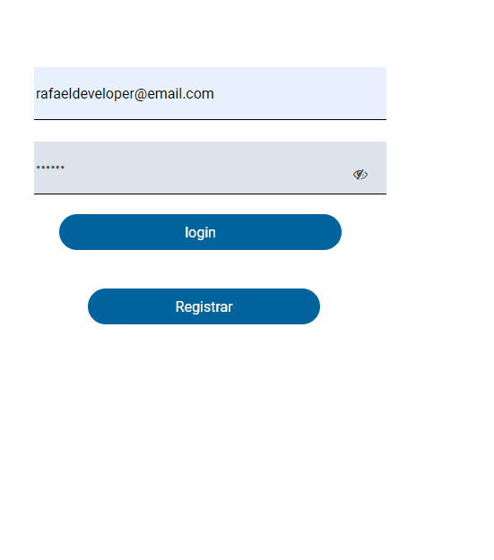
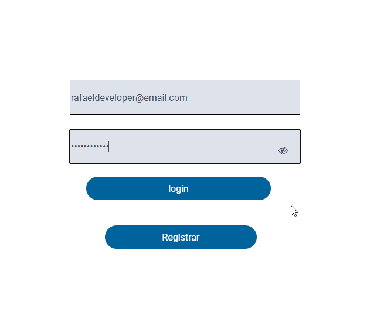

# VIZE
<h2 align="center">

    

Projeto realizado referente a segunda etapa do processo para desenvolvedor de front-end.

</h2>

 <a href='#sobre'>Sobre</a>
 <a href='#tecnologias'>Tecnologias</a>
 <a href='#preview'>Preview</a>
 <a href='#pré-requisitos'>Pré-requisitos</a>
 <a href='#api'>API</a>
 <a href='#autor'>Autor</a>

# Sobre

Projeto com o objetivo de avaliar os conhecimentos quanto a organização e legibilidade de código. Bem como, a organização de idéias

# Tecnologias

   Javascript
  HTML5
 CSS3

# Preview
<h4 align="center">

# Pré-requisitos
Antes de começar, é bom ter um bom editor para trabalhar com o código como o [VSCode](https://code.visualstudio.com), foi também utilizado a extenção do VSCode chamada [Live Server](https://marketplace.visualstudio.com/items?itemName=ritwickdey.LiveServer).
Além disso, para realizar testes na API solicitada foi utilizados ferramentas como o [Postman](https://www.postman.com/). Mas também, pode ser utilizado o [Insomnia](https://insomnia.rest/download).

# API
Utilizar a API: https://www.appsloveworld.com/sample-rest-api-url-for-testing-with-authentication, porém com o host “https://devfront.vize.solutions”
Neste aplicativo serão utilizados os seguintes endpoints:
https://devfront.vize.solutions/api/authaccount/registration   
https://devfront.vize.solutions/api/authaccount/login  
https://devfront.vize.solutions/api/users?page=1 

# Autor
Rafael Pino

---
Made with 💜 by Rafael Pino 👋 [see my linkedin](https://www.linkedin.com/in/rafael-pino-739442a3/)
